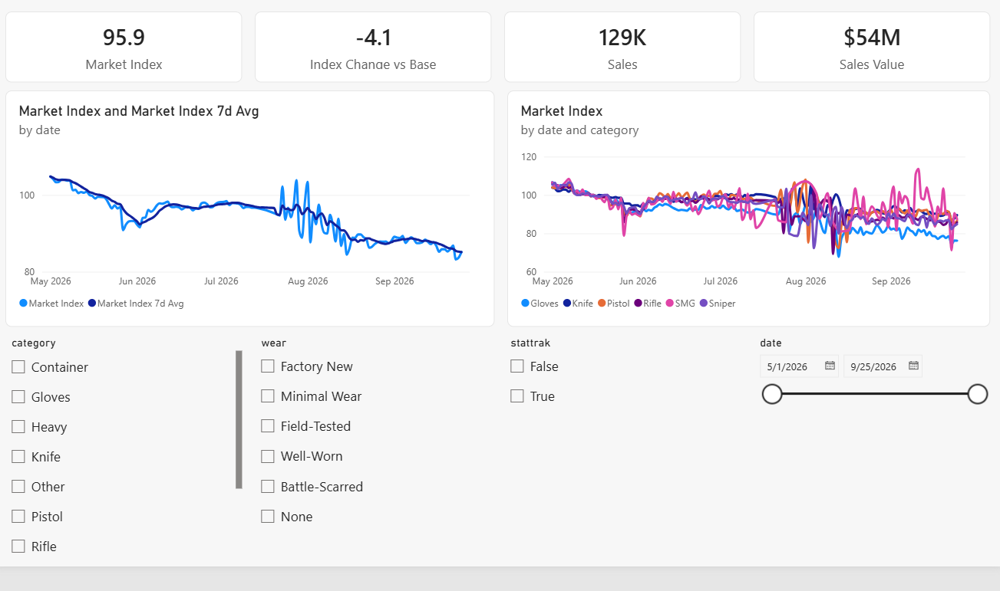
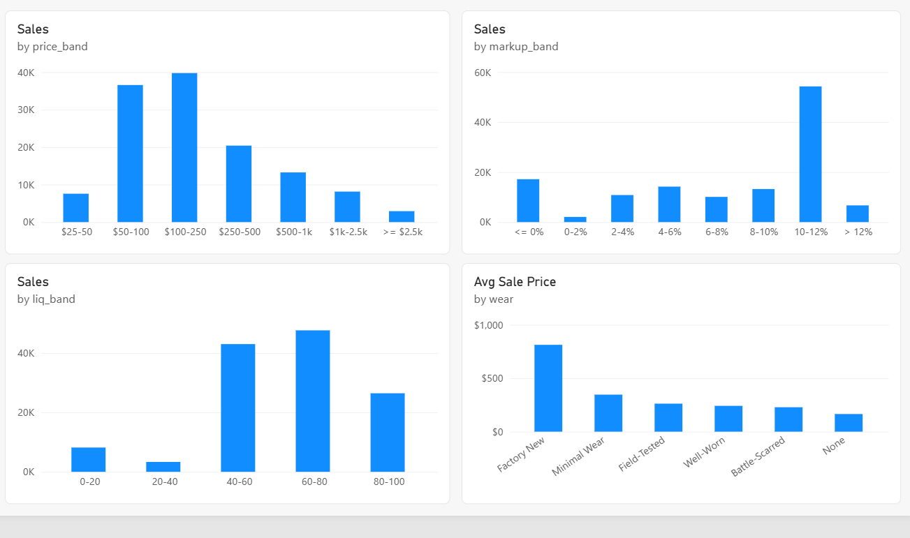
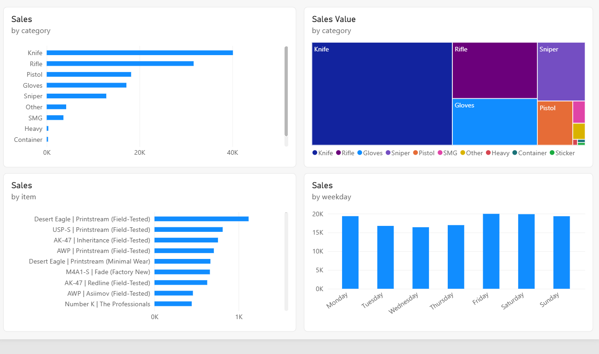
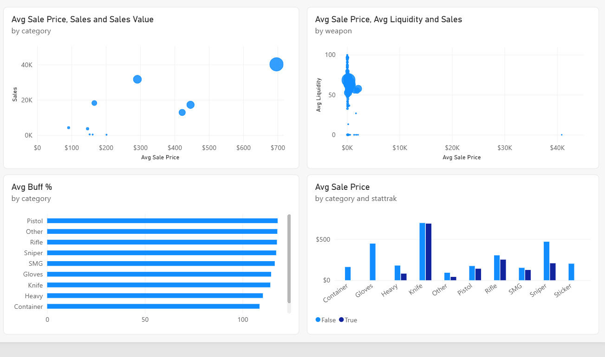
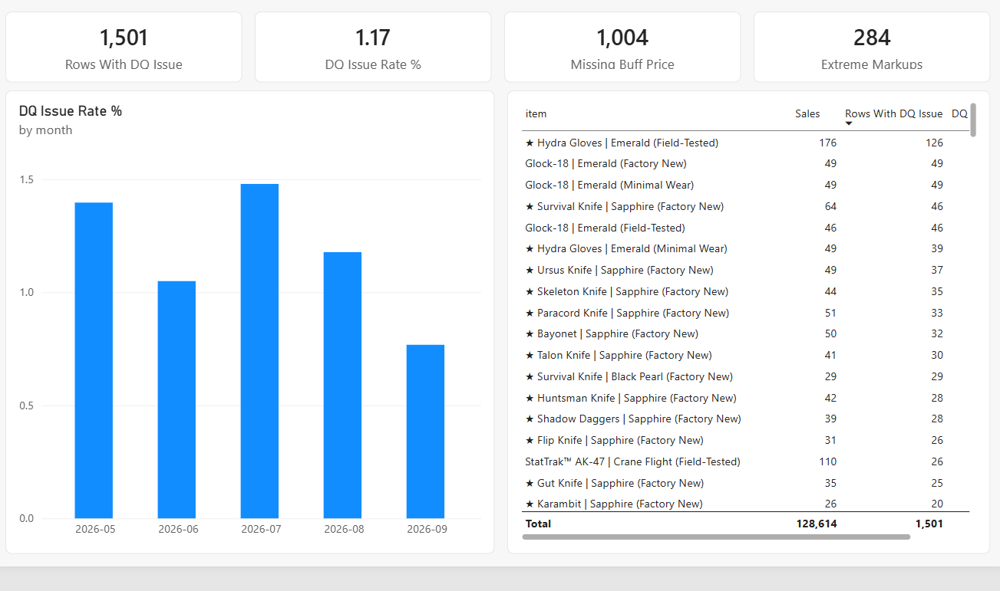
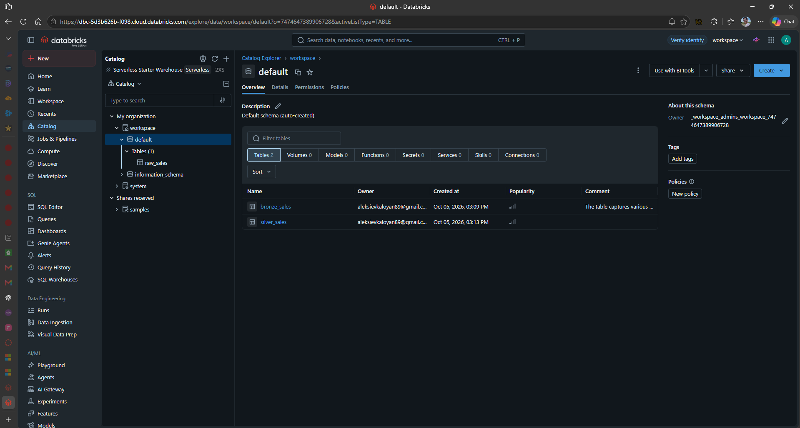
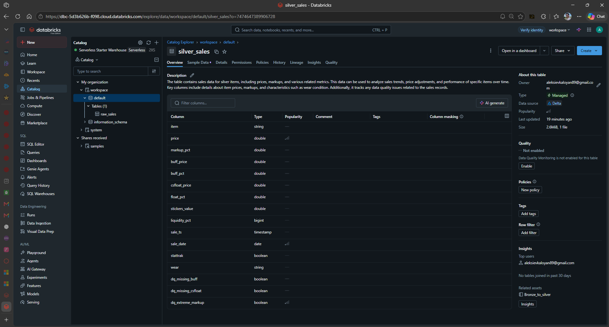

# CS2 market index (Power BI)

I wanted to see how the CS2 item market actually moved over the summer, so I built a price index
and a data quality report in Power BI on top of sales data I collected myself.

The data is 128,614 completed sales of 5,559 items on a CS2 item marketplace, from May to
September 2026.

## Where the data comes from

None of this comes from a ready-made dataset or a public API, I built the data collection myself.
My scrapers pick up every completed sale on the marketplace worth 40 coins or more (the
marketplace's own currency). That's the segment I care about: below 40 the handling per item isn't
worth it for logistical reasons, so I don't follow that part of the market. The reference prices are
scraped too: Buff prices with a headless browser, CSFloat prices with a regular (non-headless)
browser scraper. Every sale gets matched with those reference prices and stored as a row in a table.

The scrapers have been running 24/7 for over a year with very little downtime. To get there:

- every source (the marketplace, Buff and CSFloat) has more than one scraper running in parallel, so
  if one of them dies the others keep collecting while it gets revived, and no data is lost
- requests go through rotating proxies
- I found and fixed a memory leak in the browser scrapers, which lets them run for months without restarts
- I get an alert as soon as a source stops delivering data reliably

This report uses the May to September 2026 part of the data.

## What's in the report

The report has five pages.

### Price & Trend

The index over time with its 7 day average, and the same index split by category. Four cards at the
top show the current index, the change since May, the number of sales and their total value. You can
filter the whole page by category, date, wear and StatTrak.

### Distributions

How sales are spread across price, markup and liquidity, each as its own chart, plus the average
sale price by wear, kept in wear order (Factory New through Battle-Scarred) and not alphabetical.

### Volume & Composition

The most sold items, the number of sales per category, where the money goes per category (a treemap
of total value), and the number of sales per weekday.

### Relationships & Reference

Average price against number of sales per category, average price against liquidity per weapon, how
sale prices compare to the Buff reference price per category, and StatTrak against non-StatTrak
prices.

### Data Quality

How many rows have a problem and what share that is, the issue rate per month, and a per item table
of sales and flagged rows.

## Why these charts

I chose each chart from the task it has to serve and the kind of data behind it, following the
popular visualization framework by Tamara Munzner (what, why, how). Data is either quantitative (a
number), ordered (a natural order to it), or categorical (names with no order).

Price & Trend

- Four cards (index, change since May, sales, sales value): single quantitative values. Task: look up the headline numbers at a glance.
- Index over time with a 7 day average: time (ordered) against the index (quantitative). Task: see the trend. A line, because time runs along the x axis and the value reads off the y axis.
- Index by category: the same, split by category (categorical). Task: compare the trend between categories. One line per category, colour for category.
- Category, wear, StatTrak and date slicers: categorical and time. Task: filter the whole page.

Distributions

- Sales by price band, by markup band, by liquidity band: one quantitative attribute each, binned, with a count. Task: see the shape of each. Histograms, because the shape matters more than any total. Markup sits in a tight band, which a histogram shows and a scatter would waste.
- Average price by wear: wear (ordered) against price (quantitative). Task: compare price across wear. A bar kept in wear order (Factory New to Battle-Scarred), not alphabetical, because wear is ordered.

Volume & Composition

- Most sold items: item (categorical) against a count. Task: identify and rank the top items. A ranked bar, top fifteen.
- Value by category: category against total value (quantitative), as parts of a whole. Task: see how the value splits across categories. A treemap.
- Sales by category: category against a count. Task: compare volume across categories. A bar.
- Sales by weekday: weekday (ordered) against a count. Task: compare volume across the week. A column chart in weekday order.

Relationships & Reference

- Price against volume per category, sized by value: two quantitative attributes plus a size. Task: see how price and volume relate across categories. A bubble scatter.
- Price against liquidity per weapon: two quantitative attributes. Task: see whether price and liquidity move together. A scatter aggregated to the weapon, not every sale, so 5,500 items don't become an unreadable cloud.
- Average price against the Buff reference per category: category against a ratio (quantitative). Task: compare how sale prices sit against Buff across categories. A bar.
- Price by category, StatTrak against standard: category and a yes/no split against price. Task: compare StatTrak and non-StatTrak prices. A grouped column.

Data Quality

- Four cards (flagged rows, issue rate, missing Buff prices, extreme markups): single quantitative values. Task: look up the headline quality numbers.
- Issue rate by month: month (ordered) against a rate (quantitative). Task: see whether quality changes over time. A column chart by month.
- Per item table: item (categorical) against sales and flagged counts (quantitative). Task: look up exact numbers and find the worst items. A sortable table.

## How the index works

Every sale is compared to what that same item usually sold for in May. So if an AK sold for 90
and its May median was 100, that sale counts as 0.9. The index for a day is the median of all
those numbers times 100, so 100 means "May prices".

I used the median on purpose. Weird sales aren't rare in this market: a rare pattern, an extreme
float or expensive stickers can make one copy of a skin worth 10 or even 100 times its normal price
to the right collector. Those sales are real, not errors, but one of them would pull an average all
over the place. The median doesn't care, in either direction.

I also thought about cutting off everything above 3 standard deviations of the mean, but it doesn't
really work here: the same extreme sales inflate the mean and the standard deviation the cutoff is
based on, so a lot of them would survive it. If I wanted a cutoff I'd use one based on the median
absolute deviation instead. For a "what does a typical sale cost" index, the median is enough.

Items with fewer than 3 sales in May are left out of the index because there's no reliable base
price for them. Every item counts the same in the index, so it shows how the typical item's price
moved, not how the total value of the market moved.

About 91.5% of all sales end up in the index. The rest are items without enough May sales, or
sales with an extreme markup.

The index is built from completed sales only, so it shows what people actually paid, not what
sellers were asking. The price also includes the seller's markup on top of the reference price.
Every day's median comes from whatever happened to sell that day, so quiet days are noisier. That's
why the report shows a 7 day average and the number of sales next to the index. Prices are in the
marketplace's coins, not dollars, and days are in UTC.

By late September the index sits around 85, so the market is roughly 15% below where it was in May.

## Limitations

The 40 coin floor makes sense for what I'm looking at, but it does bias the index when the market
falls. When an item drops below 40 its sales stop showing up in the data, so the items that fell
the most leave the index exactly when prices go down. The real drop for the whole market is
probably a bit bigger than 15%. For the segment above 40 the number holds.

## Data quality checks

Real sales data is messy, so every row gets flagged if:

- the reference price from Buff is missing
- the CSFloat price is missing
- the markup is extreme (above 100% or below -50%)
- the price is more than 10x the Buff price

1,501 sales have at least one flag. They stay in the data and get reported on their own page, but
extreme markups are kept out of the index.

## The data pipeline (Databricks)

The data runs through a medallion pipeline in Databricks. The raw sales land as `bronze_sales`,
exactly as collected. A PySpark notebook (`databricks/bronze_to_silver.ipynb`) cleans that into
`silver_sales`: proper types, wear and StatTrak pulled out of the item name, a data quality flag on
every row instead of dropping anything, and duplicates removed. Out of 128,614 rows only one was a
duplicate, so the collection itself is clean.

A gold step (`databricks/silver_to_gold.py`) builds the star schema: a sales fact plus an item and a
date table, with the index fields worked out in the pipeline (each sale compared to its item's May
baseline). The Power BI report reads straight from these gold tables over the Databricks SQL endpoint.

## What I'd do next

- a value-weighted version, so it shows how the total value of the market moved and not only the
  typical item
- the same index built on Buff reference prices instead of sale prices, as a check that the trend
  isn't just sellers changing their markups

## Data model

Simple star schema:

- `fact_sales` - one row per sale (price, markup, reference prices, liquidity, index fields, quality flags)
- `dim_item` - item name split into weapon, skin, wear, StatTrak, souvenir and category
- `dim_date` - calendar table

The pipeline builds these three tables from the raw sales. The raw data isn't in this repo.

## Files

- `CS2_Market_Index.pbip`, with the `CS2_Market_Index.Report` and `CS2_Market_Index.SemanticModel`
  folders next to it - the Power BI project (report plus semantic model)
- `build_dataset.py` - the same data prep in pandas
- `screenshots/` - one image per page
- `databricks/bronze_to_silver.ipynb` - the bronze to silver notebook (PySpark), with the catalog
  and schema screenshots in the same folder
- `databricks/silver_to_gold.py` - the gold step (PySpark) that builds the star schema the report reads
